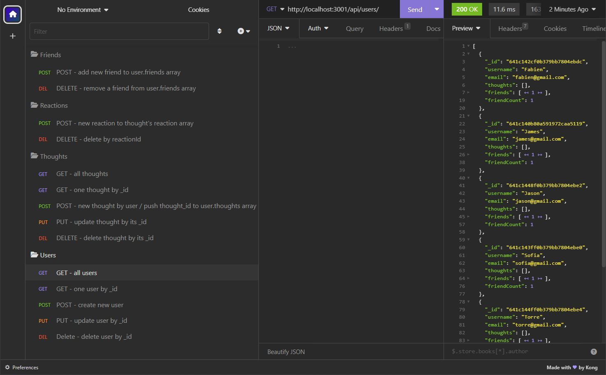

# ***Social-Butterfly-API***

 

## Description
This is a back-end CRUD application which allows a user to CREATE, READ, UPDATE, and DELETE data from a database. This application is a social media platform where users can post their thoughts, react to friends’ thoughts, and create a friend list. This application uses Express.js for routing, a MongoDB database, and the Mongoose ODM.
 

## Table of Contents
- [Installation](#installation)
- [Usage](#usage)
- [Technologies Used](#technologies-used)
- [Questions](#questions)
- [Contributing](#contributing)
- [License](#license)
 

## Installation
You must have node.js installed on your system.
 
You must install all of the npm packages listed below.
 
Optional Dev Dependencies are listed but not required.
 
The packages must also be imported into the project.
 

&emsp;*Dependencies:*
     &emsp;1) EXPRESS v4.18.2
     &emsp;2) MONGOOSE v6.9.2

&emsp;*Dev Dependencies:*
     &emsp;3) DOTENV v16.0.3
     &emsp;4) NODEMON v2.0.22
 

## Usage
See a live demo video @ https://drive.google.com/file/d/1jYFCAPpbe7rFcxH81_WmcfsV3M_IW-Th/view
 
View the repository code @ https://github.com/jk377y/Social-Butterfly-API
 

Here is an example of a GET request to the /api/users route:
 

 

## Technologies Used
- Dotenv (v16.0.3) @ https://www.npmjs.com/package/dotenv
- Express.js (v4.18.2) @ https://www.npmjs.com/package/express
- Insomnia (v2023.1.0) @ https://insomnia.rest/
- Mongoose (v6.9.2) @ https://www.npmjs.com/package/mongoose
- Node.js (v18.14.0) @ https://nodejs.org/en/ (for runtime environment)
- Nodemon (v2.0.22) @ https://www.npmjs.com/package/nodemon
 

## Questions
For Questions, I can be reached at the following:
 

&emsp;&emsp;

## Contributing
Check out my portfolio <a href="https://jk377y.github.io/Personal-portfolio/" target="_blank">here.</a>
 
You can help support me by donating with 💵Cash App💵 @ 💵$JK377Y💵
 

## License

 Copyright (c) 2023 James Kelly
 Information on this license can be found at: (https://opensource.org/licenses/MIT)